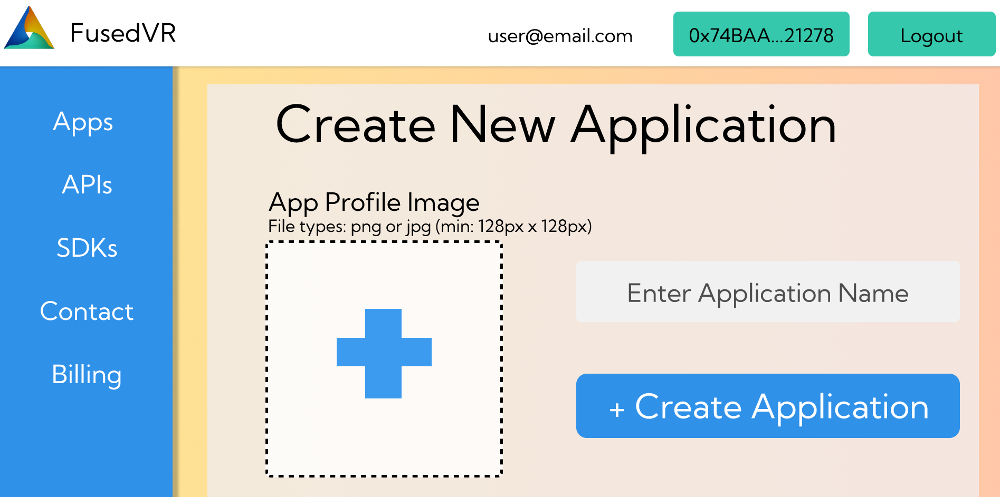
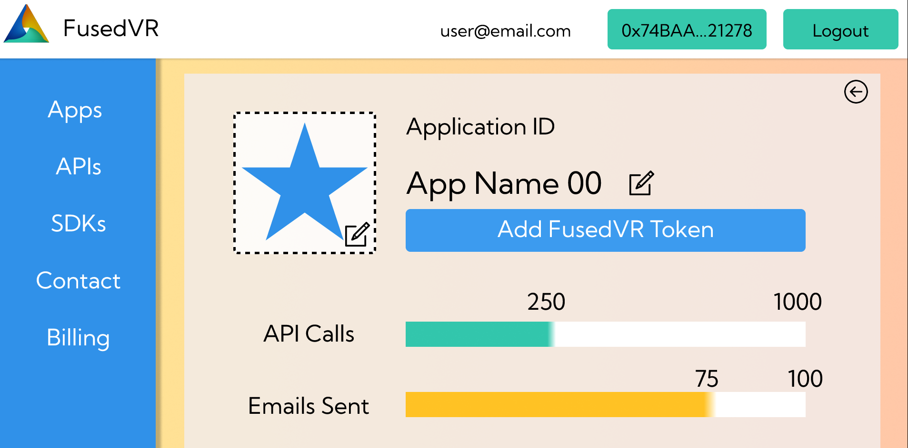

# Application Management

Through the ChainAuth Console, you will be able to create, manage, and monitor the usage of the ChainAuth SDK or APIs for your game or application. Simply log-in into the console with an e-mail address and a Web 3 wallet to get started. 

## Create App

To start using the APIs and SDKs, you will need to create an application to receive an App ID, which can be used for the login function.

```csharp
bool isLoggedIn = await Web3Manager.Login("email", "appId");
```
Creating an application just requires an **App Image** and **App Name**, which will be used to customize the login authentication email that is sent out to your players. 



## Billing

As a platform designed for Web 3 Game Developers, payments and billing for the service are managed in a Web 3 native way powered by [Cask.fi](https://www.cask.fi/). Cask Fi is a blockchain subscription payments service that will allow you to pay for access to the FusedVR APIs on a monthly cadence on the Polygon network with different US backed stablecoins. 

Because Cask Fi handles the payments, you will need to interact with their service to top off your funds to continue paying for FusedVR ChainAuth if you run out of funds in their wallet. 

## Monitoring

Once you roll your game into production, you will want to monitor how your application is being used and see if you are approaching any limits. By clicking on an application from the dashboard, you will be able to view the application stats and edit your application as needed.

