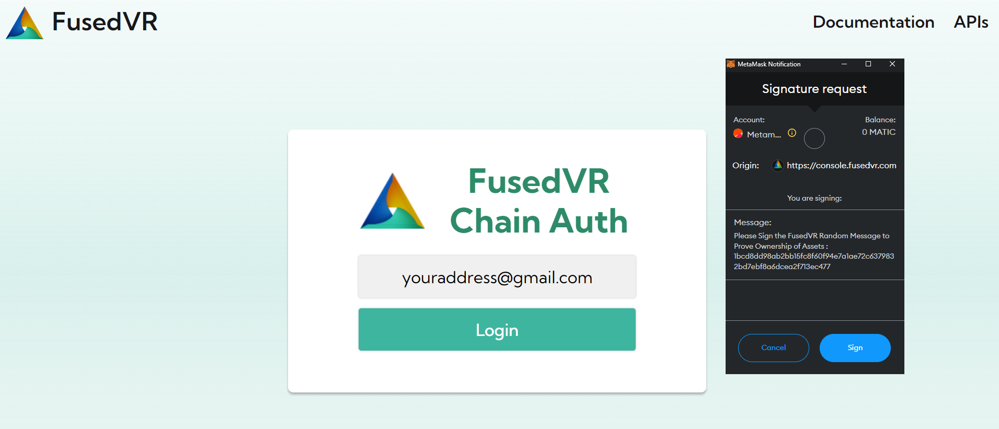
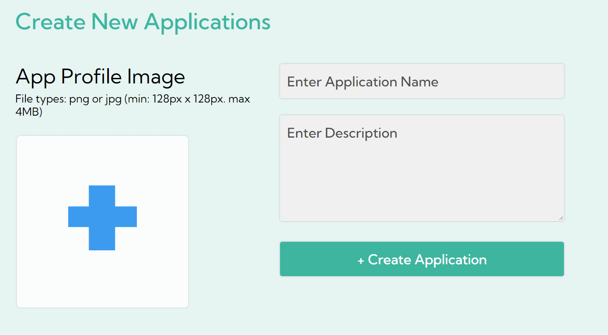
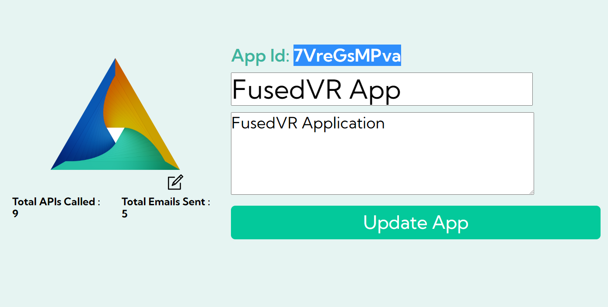

# Getting Started

The FusedVR ChainAuth APIs are designed to be as simple as possible to integrate into any game or application. 

First you will need an Application ID for your project. To create one, log into the Chain Auth console at [https://console.fusedvr.com](https://console.fusedvr.com). To log in, you will need an email and a crypto wallet such as [Metamask](https://metamask.io/). Sign the message requested with your crypto wallet and then verify your e-mail address to contiue into the Console. 

## Create Application

Once logged into the console, you will need to create an application, which will need the following:

- Application Name
- Application Description
- Profile Image

After you have created an application, you will see the application page, where you can update the data about the application and also get the application id. This is the ID you need to input into the SDK. 

## Application ID

Once you have an Application ID, you can start using either 
- <a href="https://api-crypto.fusedvr.com" target="_blank">The FusedVR Crypto APIs</a> 
- <a href="https://github.com/FusedVR/web3-unity-sdk" target="_blank">The Unity SDK</a> wrapper for making requests and authenticating players. 

For a guide on how to use the Unity SDK, please refer to the [Hello World tutorial]("/docs/tutorials/helloworld/").

For any support, ping @Fuseman in the [FusedVR Discord](https://discord.com/invite/rV8fEAmG5B) in the #chainauth channel.  

